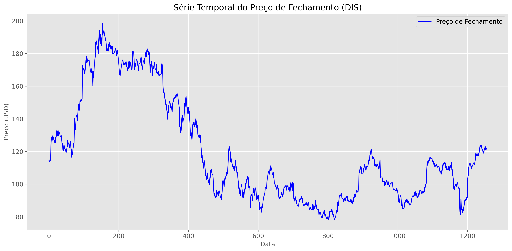

# Tech Challenge Fase 4

## Objetivo

**Criar um modelo preditivo de redes neurais Long Short Term Memory (LSTM)** para predizer o valor de fechamento da bolsa de valores de uma empresa à sua escolha (Disney - DIS) e realizar toda a pipeline de desenvolvimento, desde a criação do modelo preditivo até o **deploy do modelo em uma API** que permita a previsão de preços de ações.

## Pipeline de desenvolvimento do modelo

Este documento descreve o processo de coleta, análise exploratória e preparação dos dados para o modelo preditivo de preços de ações utilizando LSTM. Etapas fundamentais para o bom desempenho dos algoritmos.

Neste trabalho, realizamos um tratamento cuidadoso que inclui a normalização das séries temporais, tratamento de valores ausentes, criação de janelas deslizantes para o treinamento da LSTM, e a separação adequada entre conjuntos de treinamento e teste. Essas etapas garantem que os dados estejam no formato adequado para alimentar o modelo e capturar os padrões temporais inerentes aos preços das ações.

### Para execução direta do pipeline

`Sempre ativar o ambiente virtual python do projeto`.

`Sempre executar os scripts a partir da pasta raiz do projeto`.

Ex.:
```bash
source .venv/bin/activate # Ativar o ambiente virtual python do projeto.
python scripts/analise_exploratoria.py # Executar a partir da pasta raiz do projeto.
```

1 - Coleta dos dados históricos da Disney (DIS)

```bash
python scripts/coleta_dados.py
```
Gera arquivo CSV com os dados históricos da Disney (DIS) na pasta dados/

2 - Realiza pre processamento dos dados históricos da Disney (DIS)

```bash
python scripts/preprocessamento.py historico_DIS_20250727.csv --janela 20 --passo 5
```
Gera arquivo `dados_preparados_janela20_passo5.npz` na pasta dados/preparados/

3 - Treinamento do modelo

```bash
python scripts/treinamento.py dados/preparados/dados_preparados_janela20_passo5.npz --output_dir modelos/janela20_passo5 --nome_modelo modelo_janela20.h5
```

4 - Artefatos Gerados

- Arquivos gerados para serem usados na predição:
  - Arquivo `modelo_janela20.h5` na pasta `modelos/janela20_passo5/`, contendo o modelo treinado.
  - Arquivo `escalonador_Close.joblib` na pasta `modelos/escalonadores/`, contendo o escalonamento dos dados para normalização.
  

- Arquivos gerados durante preprocessamento:
  - Arquivo `historico_DIS_20250727.csv` na pasta `dados/`, contendo os dados históricos da Disney (DIS), coletados com o yfinance.
  - Arquivo `dados_preparados_janela20_passo5.npz` na pasta `dados/preparados/`, contendo os dados preparados para treinamento.
  
- Arquivos gerados durante treinamento:
  - Pasta `modelos/janela20_passo5/`
    - Arquivo `modelo_janela20.h5` contendo o modelo treinado.
    - Arquivo `metricas.json` contendo as métricas de treinamento, validação e teste.
    - Arquivos `loss_evolution.png` e `mae_evolution.png` contendo os gráficos de evolução das métricas (loss e MAE - Erro Médio Absoluto) durante o treino e validação.
    - Pasta `logs/` contendo os logs do treinamento gerados pelo TensorBoard. É possivel visualizar os logs do treinamento pelo TensorBoard.
  
  Da pasta raiz do projeto, execute o seguinte comando para iniciar o TensorBoard:
```bash
tensorboard --logdir=modelos/janela20_passo5/logs
```

## 1. Coleta de Dados

O script `coleta_dados.py` é responsável pela coleta e análise exploratória dos dados históricos da Disney (DIS) utilizando a biblioteca yfinance para obtenção e pandas para análise exploratória. Esta seção detalha a estrutura e funcionalidades do script.

### Estrutura do Código

#### `baixar_dados_historicos(simbolo='DIS', anos_historico=5)`
- **Propósito**: Baixa dados históricos da ação especificada
- **Parâmetros**:
  - `simbolo`: Símbolo da ação (padrão: 'DIS' para Disney)
  - `anos_historico`: Número de anos de histórico a serem baixados (padrão: 5)
- **Retorno**: DataFrame do pandas com os dados históricos
- **Funcionalidades**:
  - Calcula o período de datas com base nos anos solicitados
  - Baixa os dados usando a API do Yahoo Finance
  - Inclui tratamento de erros para falhas na conexão

#### `analisar_dados(df, simbolo='DIS')`
- **Propósito**: Realiza análise exploratória dos dados
- **Parâmetros**:
  - `df`: DataFrame com os dados históricos
  - `simbolo`: Símbolo da ação para referência nos gráficos (padrão: 'DIS')
- **Saídas**:
  - Estatísticas descritivas
  - Verificação de dados faltantes
  - Cálculo de retornos diários
  - Geração de gráficos (preço, volume, retornos, distribuição)

#### `salvar_dados(df, simbolo='DIS')`
- **Propósito**: Salva os dados processados em arquivos
- **Parâmetros**:
  - `df`: DataFrame com os dados históricos
  - `simbolo`: Símbolo da ação para nome do arquivo (padrão: 'DIS')
- **Saídas**:
  - Arquivo CSV com os dados
  - Arquivo Parquet (formato mais eficiente)
  - Cria diretório 'dados' se não existir

#### `verificar_qualidade_dados(df, simbolo='DIS')`
- **Propósito**: Verifica a qualidade dos dados coletados
- **Parâmetros**:
  - `df`: DataFrame com os dados históricos
  - `simbolo`: Símbolo da ação para referência (padrão: 'DIS')
- **Funcionalidades**:
  - Verifica consistência dos dados
  - Identifica possíveis anomalias
  - Gera relatório de qualidade

### Fonte de Dados
- Utilizamos a biblioteca `yfinance` para coletar dados históricos de preços de ações diretamente do Yahoo Finance.
- Ação escolhida para análise: Walt Disney Company (símbolo: DIS)
- Período de coleta: 28/07/2020 a 25/07/2025
- Frequência dos dados: Diária

### Estrutura dos Dados Coletados
Os dados coletados contêm as seguintes informações para cada dia de negociação:
- **Open**: Preço de abertura da ação
- **High**: Maior preço atingido no dia
- **Low**: Menor preço atingido no dia
- **Close**: Preço de fechamento da ação
- **Adj Close**: Preço de fechamento ajustado (considera desdobramentos e proventos)
- **Volume**: Número de ações negociadas no dia

### Código de Coleta

Obtem os 5 anos anteriores à data atual, utilizando a biblioteca yfinance.  Funciona para qualquer código de ação, mas está configurado para Disney (DIS) por padrão.

```python
def baixar_dados_historicos(simbolo='DIS', anos_historico=5):
    """
    Baixa os dados históricos da Disney (DIS).
    """
    # Calcula as datas
    data_fim = datetime.now()
    data_inicio = data_fim - timedelta(days=365 * anos_historico)
    data_inicio_str = data_inicio.strftime('%Y-%m-%d')
    data_fim_str = data_fim.strftime('%Y-%m-%d')
    
    print(f"\nBaixando dados históricos de {simbolo} de {data_inicio_str} até {data_fim_str}...")
    
    try:
        # Baixa os dados usando yfinance
        df = yf.download(
            simbolo,
            start=data_inicio_str,
            end=data_fim_str,
            progress=True
        )
    ...     
```

## 2. Análise Exploratória Inicial

A análise exploratória tem como objetivo entender as características dos dados, identificar possíveis problemas e obter insights iniciais.

### 2.1 Dados Ausentes

Não há dados ausentes nos dados coletados.

# Relatório de Dados Ausentes

| Price   |   Total de ausentes|   Percentual de ausentes|
|:--------|-------------------:|------------------------:|
| Close   |                  0 |                       0 |
| High    |                  0 |                       0 |
| Low     |                  0 |                       0 |
| Open    |                  0 |                       0 |
| Volume  |                  0 |                       0 |
### 2.2 Utilização dos Dados Disponíveis

Serão utilizados apenas os preços de fechamento diários para aprendizado do modelo.

Também poderíamos utilizar as variações diárias de preços de fechamento para aprendizado, mas neste Techchallenge utilizaremos apenas os preços de fechamento com o modelo LSTM

### 2.3 Visualização de Série Temporal

Abaixo está o gráfico da série temporal do preço de fechamento da ação da Disney no período analisado:



Distribuição de Frequência do Preço de Fechamento da ação da Disney no período analisado:


**Análise:**
- Não há anomalias visíveis na série temporal.  Valores e variações normais do mercado.

## 3. Pré-processamento dos Dados

### 3.1 Pipeline de Pré-processamento

Implementamos um pipeline completo de pré-processamento que inclui as seguintes etapas:

1. **Carregamento dos Dados**:
   - Leitura do arquivo CSV `dados/historico_DIS_20250727.csv` gerado com dados obtidos do Yahoo Finance
   - Conversão automática de datas para o tipo datetime
   - Definição da coluna de data como índice
   - O arquivo contém `1255` dias de dados históricos

2. **Normalização dos Dados**:
   - Utilização do MinMaxScaler para normalizar os valores entre 0 e 1
   - O escalonador é salvo na pasta `modelos/escalonadores/` para uso futuro na inversão das previsões

3. **Criação de Sequências Temporais**:
   - Divisão dos dados em janelas deslizantes de 60 dias com duas abordagens testadas:
     1. **Sem sobreposição (step=60)**: Gera 20 sequências independentes
        - Ideal para evitar vazamento de dados entre conjuntos
        - Cada sequência inicia 60 dias após a anterior
     2. **Com sobreposição parcial (step=5)**: Gera 239 sequências
        - Aumenta significativamente o número de amostras de treinamento
        - Cada nova sequência inicia 5 dias após a anterior, mantendo a janela de 60 dias
   - As sequências normalizadas são salvas na pasta `dados/preparados/` em arquivos NPZ, contendo:
     - Dados de treino (X_train, y_train): 70% das amostras
     - Dados de validação (X_val, y_val): 10% das amostras
     - Dados de teste (X_test, y_test): 20% das amostras

### 3.2 Divisão dos Dados
   - Treino (70%) - Usado para treinamento do modelo
   - Validação (10%) - Usado durante o treinamento para ajustes dos hiperparâmetros do modelo
   - Teste (20%) - Usado para avaliação do desempenho do modelo
   - A divisão é feita mantendo a ordem temporal dos dados

### 3.3 Estrutura dos Dados Processados

Os dados processados são salvos em um arquivo NPZ contendo os seguintes arrays NumPy:

- **X_train**: Array 2D (amostras, time_steps contendo o valor de fechamento) com as sequências de treino
- **y_train**: Array 1D com os valores alvo de treino
- **X_val**: Array 2D com as sequências de validação
- **y_val**: Array 1D com os valores alvo de validação
- **X_test**: Array 2D com as sequências de teste
- **y_test**: Array 1D com os valores alvo de teste

### 3.4 Estrutura dos dados para o treinamento

O modelo LSTM (Long Short-Term Memory) precisa que os dados de entrada estejam organizados em um array tridimensional (3D) para conseguir lidar bem com sequências temporais. Esse formato 3D inclui: (1) o número de amostras, que são as sequências completas usadas no treinamento; (2) os passos de tempo (time steps), que indicam o tamanho da janela temporal — neste projeto, 60 dias; e (3) as características (features), que são as variáveis usadas para fazer previsões - neste projeto `utilizamos apenas o preço de fechamento normalizado para treinar o modelo`. 
Essa estrutura de Array 3D é importante porque permite que a LSTM identifique padrões ao longo do tempo, mantendo informações de um passo para o outro e reconhecendo relações de longo prazo nas séries temporais. No caso deste projeto, cada sequência de 60 dias serve para prever o valor do dia seguinte, seguindo esse formato tridimensional.

A função `preparar_X` é responsável por converter os dados de entrada para o formato 3D necessário pelo LSTM e é definida e usada na função `carregar_dados`, do script `analise_treinamento.py`, no momento de carregar os dados para o treinamento.

Formato utilizado pelo LSTM

- **X_train**: Array 3D (amostras, time_steps, features) com as sequências de treino
- **y_train**: Array 1D com os valores alvo de treino
- **X_val**: Array 3D com as sequências de validação
- **y_val**: Array 1D com os valores alvo de validação
- **X_test**: Array 3D com as sequências de teste
- **y_test**: Array 1D com os valores alvo de teste

### 3.5 Scripts do Pipeline de Pré-processamento

O pipeline de pré-processamento está implementado no arquivo `preprocessamento.py`. 

Abaixo são apresentadas partes dos scripts implementados para cada etapa do pipeline:

#### 3.5.1 Carregamento dos Dados

O carregamento dos dados é feito diretamente na função de inicio do pipeline e utiliza o arquivo CSV produto da coleta (e análise exploratória) realizada pelo script coleta_dados.py

```python
def pipeline_preprocessamento(caminho_dados: str, 
                           coluna_alvo: str = 'Close',
                           tamanho_janela: int = 60,
                           passo: int = 60,
                           test_size: float = 0.2,
                           val_size: float = 0.1,
                           salvar_dados: bool = True) -> Dict[str, np.ndarray]:
    """
    Pipeline completo de pré-processamento para dados de séries temporais.
    """
    # 1. Carregar dados
    colunas = ['Date', 'Close', 'High', 'Low', 'Open', 'Volume', 'Retorno']
    dados = pd.read_csv(
        caminho_dados,
        skiprows=3,  # Pula as 3 primeiras linhas de cabeçalho
        header=None,
        names=colunas,
        usecols=range(len(colunas)),
        na_values=['', 'NaN', 'nan', 'None', 'null'],
        parse_dates=['Date'],
        date_format='%Y-%m-%d'
    )
    
    # Define a coluna de data como índice
    dados.set_index('Date', inplace=True)
    ...
```

#### 3.5.2 Normalização dos Dados

```python
def normalizar_dados(dados: pd.DataFrame, 
                   colunas: list = None, 
                   tipo_escalonador: str = 'minmax',
                   salvar_escalonador: bool = True) -> Tuple[pd.DataFrame, dict]:
    """
    Normaliza os dados usando MinMaxScaler.
    """
    if colunas is None:
        colunas = dados.select_dtypes(include=[np.number]).columns.tolist()
    
    dados_normalizados = dados.copy()
    escalonadores = {}
    ...
```

#### 3.5.3 Criação de Sequências Temporais

```python
def criar_sequencias(dados: np.ndarray, 
                   tamanho_janela: int = 60, 
                   passo: int = 60) -> Tuple[np.ndarray, np.ndarray]:
    """
    Cria sequências de entrada e saída para treinamento de modelos de séries temporais.
    """
    ...
```

#### 3.5.4 Divisão dos Dados

Realizada dentro da função preparar_dados_para_lstm(), após normalização e criação das sequencias.
A divisão dos dados foi feita em três partes (treino, validação e teste) através dos parâmetros test_size e val_size

```python
def preparar_dados_para_lstm(dados: pd.DataFrame, 
                          coluna_alvo: str = 'Close',
                          tamanho_janela: int = 60,
                          passo: int = 60,
                          test_size: float = 0.2,
                          val_size: float = 0.1,
                          random_state: int = 42) -> Dict[str, np.ndarray]:
    """
    Prepara os dados para treinamento de um modelo LSTM.
    """
    # 1. Normalizar os dados
    ...
   
    # 2. Criar sequências
    ...
    
    # 3. Dividir em treino e teste
    X_train, X_test, y_train, y_test = train_test_split(
        X, y, test_size=test_size, random_state=random_state, shuffle=False
    )
    
    # 4. Separar validação do treino, se necessário
    if val_size > 0:
        val_size_relative = val_size / (1 - test_size)
        X_train, X_val, y_train, y_val = train_test_split(
            X_train, y_train, 
            test_size=val_size_relative, 
            random_state=random_state,
            shuffle=False
        )
        
        return {
            'X_train': X_train, 'y_train': y_train,
            'X_val': X_val, 'y_val': y_val,
            'X_test': X_test, 'y_test': y_test
        }
    else:
        return {
            'X_train': X_train, 'y_train': y_train,
            'X_test': X_test, 'y_test': y_test
        }
    ...
```

#### 3.5.5 Execução do Pipeline de pré-processamento completo

A execução do pipeline de pre-processamento (`scripts/preprocessamento.py`) deve ocorrer após a coleta (e análise exploratória) realizados através do script `scripts/coleta_dados.py`. Neste tech challenge, o arquivo gerado e analisado foi o historico_DIS_20250727.csv, que é o arquivo de entrada para o pipeline de pré-processamento do trabalho.

```python
# Exemplo de uso do pipeline completo
if __name__ == "__main__":
    caminho_dados = os.path.join(data_dir, 'historico_DIS_20250727.csv')
    
    if os.path.exists(caminho_dados):
        print("Iniciando pipeline de pré-processamento...")
        dados_preparados = pipeline_preprocessamento(
            caminho_dados=caminho_dados,
            coluna_alvo='Close',
            tamanho_janela=60,
            test_size=0.2,
            val_size=0.1,
            salvar_dados=True
        )
        print("Pré-processamento concluído com sucesso!")
    else:
        print(f"Arquivo não encontrado: {caminho_dados}")
```

## 4. Análise de Dados Preparados

Foram realizados três grupos distintos de testes na preparação das sequências temporais para o treinamento do modelo LSTM, cada um com diferentes configurações de janela e passo. Estes testes estão documentados detalhadamente no arquivo [analise_comparativa.md](analise_comparativa.md).

### Configurações Testadas

1. **janela60_passo5**
   - **Tamanho da janela**: 60 dias
   - **Passo**: 5 dias (sobreposição de 55 dias)
   - **Número de amostras**: 239 sequências
   - **Arquivos salvos**: `modelos/janela60_passo5/`

2. **janela60_passo60**
   - **Tamanho da janela**: 60 dias
   - **Passo**: 60 dias (sem sobreposição)
   - **Número de amostras**: 20 sequências
   - **Arquivos salvos**: `modelos/janela60_passo60/`

3. **janela20_passo5**
   - **Tamanho da janela**: 20 dias
   - **Passo**: 5 dias (sobreposição de 15 dias)
   - **Número de amostras**: 247 sequências
   - **Arquivos salvos**: `modelos/janela20_passo5/`

### Configuração Selecionada

Após análise comparativa, a configuração **janela20_passo5** foi selecionada por apresentar o melhor equilíbrio entre desempenho e generalização, com as seguintes métricas no **conjunto de teste**:

- **MSE**: 0,00415 (menor entre as configurações)
- **MAE**: 0,04806 (12% menor que a segunda melhor configuração)
- **MAPE**: 29,37% (melhor entre as configurações testadas)
- **R²**: 0,5133 (significativamente melhor que as demais configurações)


### Estrutura dos Arquivos Gerados

Para cada configuração testada, foram gerados os seguintes arquivos no respectivo diretório de saída (`modelos/[configuração]/`):

1. **modelo_[configuração].h5**: Modelo treinado
2. **metricas.json**: Métricas detalhadas de treino, validação e teste
3. **loss_evolution.png**: Gráfico da evolução da perda durante o treinamento
4. **mae_evolution.png**: Gráfico da evolução do MAE durante o treinamento
5. **logs/**: Pasta com logs detalhados do TensorBoard

A análise completa dos resultados e comparações entre as configurações de sequência pode ser encontrada no arquivo [analise_comparativa.md](analise_comparativa.md).

## 5. Treinamento do Modelo

Um treinamento inicial do modelo LSTM foi realizado utilizando diferentes configurações de sequências temporais, com foco especial na arquitetura da rede e nas sequencias temporais para o treinamento.  As 3 configurações de sequências temporais da seção 4 deste documento foram submetidas ao treinamento inicial. A partir da análise dos resultados, foi selecionada a configuração **janela20_passo5** para o treinamento final.  Este treinamento inicial, utilizado para escolha das melhores configurações de sequencias temporais foi implementado no script `scripts/treinamento.py`.

O comando abaixo realiza o treinamento inicial do modelo, gravando o resultado no diretório `modelos/janela20_passo5`.
```bash
python scripts/treinamento.py dados/preparados/dados_preparados_janela20_passo5.npz  --output_dir modelos/janela20_passo5 --nome_modelo modelo_janela20.h5
```
## 5.1 **Hiperparâmetros do Modelo treinado inicialmente(janela20_passo5)**

**Hiperparâmetros de Arquitetura**
- Tamanho da Janela Temporal (window_size): 60 dias úteis
- Arquitetura LSTM:
  - Primeira camada LSTM: 50 unidades
  - Dropout: 20%
  - Segunda camada LSTM: 25 unidades
  - Camada Densa: 10 unidades com ativação ReLU
  - Camada de Saída: 1 unidade com ativação linear

**Hiperparâmetros de Treinamento**
- Tamanho do Lote (batch_size): 32
- Número Máximo de Épocas (epochs): 100
- Taxa de Aprendizado (learning_rate): 0.001
- Regularização L2 (l2_lambda): 0.01
- Taxa de Dropout (dropout_rate): 0.2

**Callbacks**
- Early Stopping: Paciência de 15 épocas monitorando val_loss
- Redução de Learning Rate: Reduz LR em 50% após 5 épocas sem melhoria
- Checkpoint: Salva o melhor modelo baseado em val_loss

**Divisão dos Dados**
- Treino/Validação/Teste: 70%/10%/20% (aproximadamente)

## 5.2 **Métricas de Desempenho do Modelo treinado inicialmente(janela20_passo5)**

Aqui estão as métricas de desempenho do modelo treinado na pasta `modelos/janela20_passo5`:

**Conjunto de Treino**
- MSE (Erro Quadrático Médio): 0.00467
- MAE (Erro Absoluto Médio): 0.05277
- MAPE (Erro Percentual Absoluto Médio): 64.04%
- R² (Coeficiente de Determinação): 0.9478

**Conjunto de Validação**
- MSE: 0.00225
- MAE: 0.04010
- MAPE: 17.75%
- R²: 0.3977

**Conjunto de Teste**
- MSE: 0.00324
- MAE: 0.04077
- MAPE: 27.19%
- R²: 0.6312

## 5.3 **O Treino Final**

O treinamento final envolveu a variação de hiperparâmetros do modelo, como a quantidade de unidades na camada LSTM, a taxa de aprendizado, o tamanho do batch, a regularização L2, a taxa de dropout e o número de épocas. 

Foi utilizado o script `scripts/busca_hiperparametros/busca_hiperparam_treinamento.py` para realizar a busca desses hiperparâmetros.  

O script busca automaticamente nos seguintes intervalos, dos hiperparametros do modelo:

- **Taxa de aprendizado**: [0.1, 0.01, 0.001, 0.0001]
- **Fator de regularização L2**: [0.1, 0.01, 0.001, 0.0001]
- **Taxa de dropout**: [0.1, 0.2, 0.3, 0.4, 0.5]
- **Unidades LSTM**: [(50, 25), (64, 32), (128, 64), (64, 32, 16), (128, 64, 32)]
- **Unidades densas**: [0, 10, 20, 50]
- **Tamanho do lote**: [16, 32, 64, 128]
- **Otimizadores**: ['adam', 'rmsprop', 'sgd']
- **Épocas**: [50, 100, 150]

O melhor resultado está registrado em `modelos/busca_hiperparametros/melhores_parametros.json` e foi utilizado para configurar o treinamento final do modelo, através do script `scripts/treinamento_hiper.py`, que teve seus hiperparâmetros default alterados conforme análise realizada.

O comando abaixo realiza o treino final do modelo, utilizando os melhores parâmetros identificados:
```bash
python scripts/treinamento_hiper.py dados/preparados/dados_preparados_janela20_passo5.npz  --output_dir modelos/janela20_passo5_hiper --nome_modelo modelo_janela20_hiper.h5
```
Comparação dos resultados do treinamento final(`janela20_passo5_hiper`) com os resultados do treinamento inicial(`janela20_passo5`):

## 5.4 **Hiperparâmetros do Modelo Otimizado (janela20_passo5_hiper)**

**Hiperparâmetros de Arquitetura**
- **Tamanho da Janela Temporal (window_size)**: 20 dias úteis (diferente do modelo anterior)
- Arquitetura LSTM:
  - Primeira camada LSTM: 50 unidades
  - Dropout: 10% (reduzido de 20%)
  - Segunda camada LSTM: 25 unidades
  - Camada Densa: 10 unidades com ativação ReLU
  - Camada de Saída: 1 unidade com ativação linear

**Hiperparâmetros de Treinamento**
- Tamanho do Lote (batch_size): 32 (`mantido`)
- Número de Épocas (epochs): 50 (`reduzido de 100`)
- Taxa de Aprendizado (learning_rate): 0.01 (`aumentado de 0.001`)
- Regularização L2 (l2_lambda): 0.0001 (`reduzido de 0.01`)
- Taxa de Dropout (dropout_rate): 0.1 (`reduzido de 0.2`)
- Otimizador: Adam (`mantido`)

## 5.5 **Métricas de Desempenho Modelo Otimizado (janela20_passo5_hiper)**

Aqui estão as métricas de desempenho do modelo treinado na pasta `modelos/janela20_passo5_hiper`:

**Conjunto de Treino**
- MSE (Erro Quadrático Médio): 0.00174
- MAE (Erro Absoluto Médio): 0.03283
- MAPE (Erro Percentual Absoluto Médio): 50.03%
- R² (Coeficiente de Determinação): 0.9806

**Conjunto de Validação**
- MSE: 0.00058
- MAE: 0.01836
- MAPE: 8.34%
- R²: 0.8456

**Conjunto de Teste**
- MSE: 0.00074
- MAE: 0.02098
- MAPE: 15.68%
- R²: 0.9152


## 5.6 **Análise Comparativa do Desempenho dos Modelos**

O modelo `janela20_passo5_hiper`, com hiperparâmetros otimizados, apresentou avanços consistentes em relação ao modelo original `janela20_passo5`, com destaque em todas as métricas avaliadas:

|Métrica|Modelo Original|Modelo Otimizado|Variação (%)|
| --- | --- | --- | --- |
|MSE|0,00324|0,00074|-77,2%|
|MAE|0,04077|0,02098|-48,5%|
|MAPE|27,19%|15,68%|-42,3%|
|R²|0,6312|0,9152|+45%|

**Interpretação dos Resultados**

- Precisão: Queda expressiva nos erros (MSE, MAE) reforça que o modelo está mais próximo dos valores reais.
- Consistência: A melhora é geral — todas as métricas mostram avanço.
- Generalização: O R² acima de 0,91 no teste mostra que o modelo agora generaliza muito bem.
- Estabilidade: O MAPE mais baixo indica que os erros são menores também proporcionalmente, o que é essencial para finanças.

**O modelo janela20_passo5_hiper, com hiperparâmetros otimizados, foi selecionado para o treinamento final e será utilizado na API de previsão.**

## 6. Considerações Finais

- Os dados foram coletados, analisados e pré-processados com sucesso
- A análise exploratória mostrou que os dados são de boa qualidade, sem valores ausentes
- A normalização e a criação de sequências temporais foram realizadas conforme o esperado
- Os dados estão prontos para serem utilizados no treinamento do modelo LSTM

## 6. API para Predição

A API de predição foi desenvolvida utilizando o framework FastAPI, que permite criar APIs web de alto desempenho com Python. A API fornece um endpoint para fazer previsões de preços de ações com base em dados históricos.

### 6.1 Estrutura da API

A API está organizada da seguinte forma:

```
api/
├── app/
│   ├── __init__.py
│   ├── main.py              # Ponto de entrada da aplicação
│   ├── api/
│   │   ├── __init__.py
│   │   └── endpoints/       # Rotas da API
│   │       └── predict.py   # Endpoint de previsão
│   ├── core/
│   │   ├── __init__.py
│   │   ├── config.py        # Configurações da aplicação
│   │   └── model_loader.py  # Carregamento do modelo e scaler
│   └── models/
│       ├── __init__.py
│       └── schemas.py       # Modelos Pydantic para validação
├── requirements.txt         # Dependências do projeto
└── run.py                  # Script para iniciar a API
```

### 6.2 Endpoints Disponíveis

#### POST /api/v1/predict

Faz a previsão do preço da ação da Disney(DIS) para o próximo período (dia) com base nos dados históricos fornecidos.

**Parâmetros de Entrada (JSON):**

Os últimos 20 valores de fechamento diário da Disney(DIS) devem ser fornecidos.
```json
{
  "close": [100.5, 101.2, 102.0, 101.5, 100.8, 101.5, 102.3, 103.0, 103.5, 104.0, 103.8, 104.2, 104.5, 104.0, 103.5, 104.2, 104.8, 105.0, 104.5, 104.0]
}
```

**Resposta de Sucesso (200 OK):**
```json
{
  "predicted_price": 103.59471203176616,
  "confidence": 0.99,
  "model_version": "janela20_passo5_hiper_20250727"
}
```

**Resposta de Erro (400 Bad Request):**
```json
{
  "detail": "São necessários pelo menos 20 dias de dados históricos para fazer previsões"
}
```

#### GET /api/v1/model-info

Retorna informações sobre o modelo carregado, incluindo arquitetura e métricas.

**Resposta de Sucesso (200 OK):**
```json
{
  "model_version": "janela20_passo5_hiper_20250727",
  "input_shape": "(20, 1)",
  "last_trained": "2025-07-27"
}
```

#### Documentação da API

A documentação em formato `Swagger` permite a visualização e interação com a API, diretamente na interface.  Essa documentação interativa é gerada automaticamente pelo FastAPI. (Swagger UI: http://localhost:8000/docs)

### 6.3 Executando a API

1. Navegue até o diretório da API:
   ```bash
   cd api
   ```

2. Crie e ative um ambiente virtual (recomendado):
   ```bash
   python -m venv .venv
   source .venv/bin/activate  # Linux/Mac
   # ou
   .\.venv\Scripts\activate  # Windows
   ```

3. Instale as dependências:
   ```bash
   pip install -r requirements.txt
   ```

4. Execute a API:
   ```bash
   python run.py
   ```

5. Acesse a documentação interativa da API em:
   - Swagger UI: http://localhost:8000/docs

6. Execute a API com Docker:
   - Na seção 6.6 é abordada a execução da API utilizando-se Docker.

### 6.4 Aplicação de Teste

O script `api/tests/testa_api.py` é uma ferramenta de linha de comando que demonstra a utilização da API de previsão de preços. Ele realiza as seguintes operações:

1. **Coleta de Dados**:
   - Baixa automaticamente os últimos 30 dias corridos de dados históricos da Disney (DIS) usando a biblioteca `yfinance`
   - Processa os dados para garantir que temos pelo menos 20 dias úteis de preços de fechamento
   - Exibe informações detalhadas sobre os dados obtidos para fins de depuração

2. **Integração com a API**:
   - Envia os preços históricos para o endpoint `/api/v1/predict`
   - Processa a resposta da API para exibir a previsão de forma clara

3. **Saída**:
   - Exibe os últimos 20 preços de fechamento formatados
   - Mostra a previsão do preço para o próximo dia útil
   - Inclui o nível de confiança da previsão e a versão do modelo utilizado

#### Como Usar

Certifique-se de que a API está em execução localmente (normalmente em `http://localhost:8000`), então execute:

A pasta api é um sub-projeto, com um .venv próprio.  Para rodar o teste, ative o .venv do api.

```bash
cd api
# python -m venv .venv ## Já deve ter sido feito anteriormente, para execução da API.
source .venv/bin/activate
python tests/testa_api.py
```

#### Saída Esperada

```
=== Teste da API de Previsão de Preços ===

Obtendo dados de [data_inicial] até [data_final]...
[Informações sobre os dados baixados]

Dados obtidos com sucesso! Período: [data_inicial] a [data_final]

Últimos 5 preços de fechamento:
[Preços formatados]

Preço previsto para hoje: $XXX.XX

Nível de confiança: XX.X%
Versão do modelo: [versão_do_modelo]
```

### 6.5 Outro Exemplo de Uso da API

```python
import requests
import json

# URL da API
url = "http://localhost:8000/api/v1/predict"

# Dados de exemplo (últimos 20 preços de fechamento)
data = {
    "close": [100.5, 101.2, 102.0, 101.5, 100.8, 101.5, 102.3, 103.0, 
              103.5, 104.0, 103.8, 104.2, 104.5, 104.0, 103.5, 104.2, 
              104.8, 105.0, 104.5, 104.0]
}

# Fazer a requisição
response = requests.post(url, json=data)

# Verificar a resposta
if response.status_code == 200:
    result = response.json()
    print(f"Previsão: ${result['predicted_price']:.2f}")
    print(f"Confiança: {result['confidence']*100:.1f}%")
else:
    print(f"Erro: {response.status_code}")
    print(response.json())
```

### 6.6 Executando a API com Docker

A API pode ser facilmente executada em um container Docker, garantindo consistência entre ambientes de desenvolvimento e produção.

#### Pré-requisitos
- Docker instalado
- Docker Compose (geralmente já vem com o Docker Desktop)
- Git (para clonar o repositório, se necessário)

#### Passo a Passo

1. **Navegue até o diretório da API**:
   ```bash
   cd api
   ```

2. **Construa a imagem Docker**:
   ```bash
   docker-compose build
   ```
   
3. **Inicie o container**:
   ```bash
   docker-compose up -d
   ```
   O parâmetro `-d` executa o container em segundo plano.

4. **Verifique se o container está rodando**:
   ```bash
   docker ps
   ```
   Você deve ver o container `stock-prediction-api` na lista.

5. **Acesse a documentação da API**:
   Abra o navegador em: http://localhost:8000/docs

#### Comandos úteis

- **Ver logs do container**:
  ```bash
  docker-compose logs -f
  ```

- **Parar o container**:
  ```bash
  docker-compose down
  ```

- **Reconstruir a imagem (após alterações no código)**:
  ```bash
  docker-compose up -d --build
  ```

#### Variáveis de Ambiente

O arquivo `docker-compose.yml` já está configurado com as variáveis de ambiente necessárias. Se precisar de configurações adicionais, você pode adicioná-las no arquivo `.env` na raiz do projeto ou diretamente no `docker-compose.yml`.


